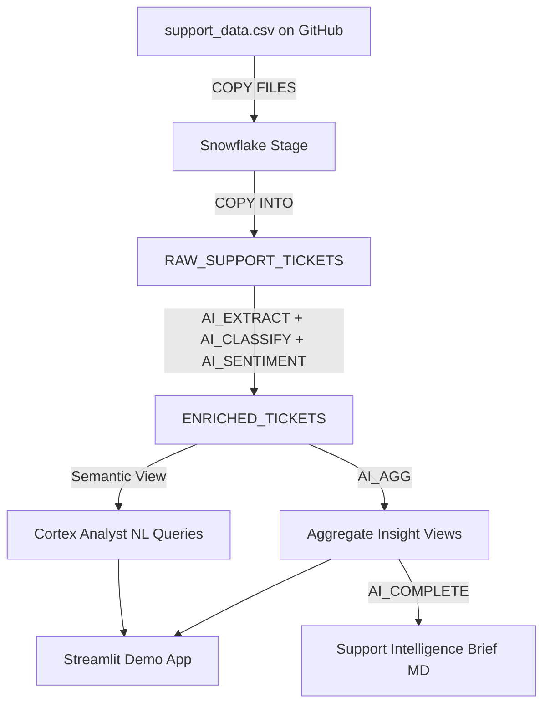

# Demo Plan: SnowCare Support Intelligence

## Fictional Company

**SnowCare** — a B2B SaaS platform for AI-powered business analytics, already referenced throughout the CSV data (product modules: Iceberg Billing System, Drift User Management, Blizzard Admin Panel). Ticket IDs follow `SP-2025-XXXXX` format, customer tiers: Basic / Enterprise.

---

## Personas

| Persona | Name | Goal |
|---|---|---|
| Customer Support Manager | Sarah Chen | Identify ticket patterns, track urgency trends, reduce escalations |
| Product Owner | David Park | Prioritize features, understand competitive threats, data-driven roadmap decisions |

**Current pain**: Sarah's team spends ~15 hours/week manually reading tickets in spreadsheets. David gets a summary deck once a quarter — too slow to act on.

---

## Data Schema

From `support_data.csv` (12,880 rows) and `AI_SOL_SUPPORT_SETUP.sql`:

```
TICKET_ID, SUBMIT_DATE, CUSTOMER_ID, CUSTOMER_TIER, CHANNEL,
PRIORITY, STATUS, PRODUCT_AREA, SENTIMENT, CLASSIFICATION,
RESPONSE_TIME, RESOLUTION_TIME, TICKET_DESCRIPTION
```

Known product areas in data: `Iceberg Billing System`, `Drift User Management`, `Blizzard Admin Panel` (+ others).

---

## Architecture



---

## Step 1: Company Brief (`assets/company-brief.md`)

Mirror the Budapest brief structure:

- **Company Background**: SnowCare, founded 2021, 4,200 customers, B2B SaaS analytics platform
- **Key Metrics**: ~4,000 support tickets/quarter, 72h avg resolution time, 18% escalation rate on Enterprise tier
- **Personas**: Sarah Chen (CS Manager) + David Park (Product Owner) with quotes and goals
- **Pain Points**: Manual analysis, reactive not proactive, no competitive signal tracking, data silos between support and product
- **POC Requirements (P0/P1)**: Automated issue classification, competitor mention detection, feature request extraction, urgency scoring
- **Success Criteria with ROI Impact**:

| Criteria | Target | ROI Impact |
|---|---|---|
| Ticket analysis time | 15 h/week to < 30 min | ~750 analyst hours saved/year (~$37K at $50/h) |
| Time-to-insight for product | Quarterly to real-time | Faster feature prioritization, shorter release cycles |
| Escalation reduction | 18% to < 12% | ~$120K/year in reduced L2/L3 support cost |
| Competitor signal detection | 0 (manual) to automated | Early competitive response — strategic value |
| Feature request capture rate | ~20% (manual) to 95%+ | Better product-market fit, reduced churn |
| AI classification accuracy | > 90% vs human labels | Trust threshold for production adoption |

---

## Step 2: Snowflake Setup (`setup.sql`)

Create DATABASE, SCHEMA, STAGE, and RAW_SUPPORT_TICKETS table. Load `support_data.csv` from GitHub via COPY FILES.

---

## Step 3: AI Enrichment Layer (`enrichment.sql`)

Create ENRICHED_TICKETS using:
- `AI_EXTRACT` — product issues, feature requests, competitor mentions, urgency signals
- `AI_CLASSIFY` — issue_type, urgency_level
- `AI_SENTIMENT` — validate/override customer-reported sentiment

---

## Step 4: Aggregate Insights (`insights.sql`)

AI_AGG queries split by persona:

**CS Manager (Sarah)**: Top 5 recurring issues, urgency distribution by product area, escalation trend by tier, sentiment by channel

**Product Owner (David)**: Top 10 feature requests ranked, competitor mentions with context, product area health score, "what are competitors offering that customers ask us to build?"

---

## Step 5: Semantic View (`semantic_view.yaml`)

Define over ENRICHED_TICKETS with metrics (ticket_count, escalation_rate, avg_resolution_time), dimensions (product_area, customer_tier, urgency_level, sentiment), and verified queries for Cortex Analyst.

---

## Step 6: Streamlit App (`app.py`)

**Tab 1 — CS Manager (Sarah)**: KPI cards, urgency heatmap, sentiment by product area, top escalations, chat via Cortex Analyst

**Tab 2 — Product Owner (David)**: Feature request ranking, competitor mention chart, product area health matrix, AI-generated prioritization, chat box

---

## Step 7: Generated Brief

AI_COMPLETE produces a markdown brief: executive summary, top product issues with quotes, competitive signals, feature prioritization ranked table, recommended actions split by persona.

---

## File Structure

```
demo/
  assets/
    company-brief.md        <- Step 1
  sql/
    setup.sql               <- Step 2
    enrichment.sql          <- Step 3
    insights.sql            <- Step 4
  semantic_view.yaml        <- Step 5
  app.py                    <- Step 6 (Streamlit)
  README.md
```
