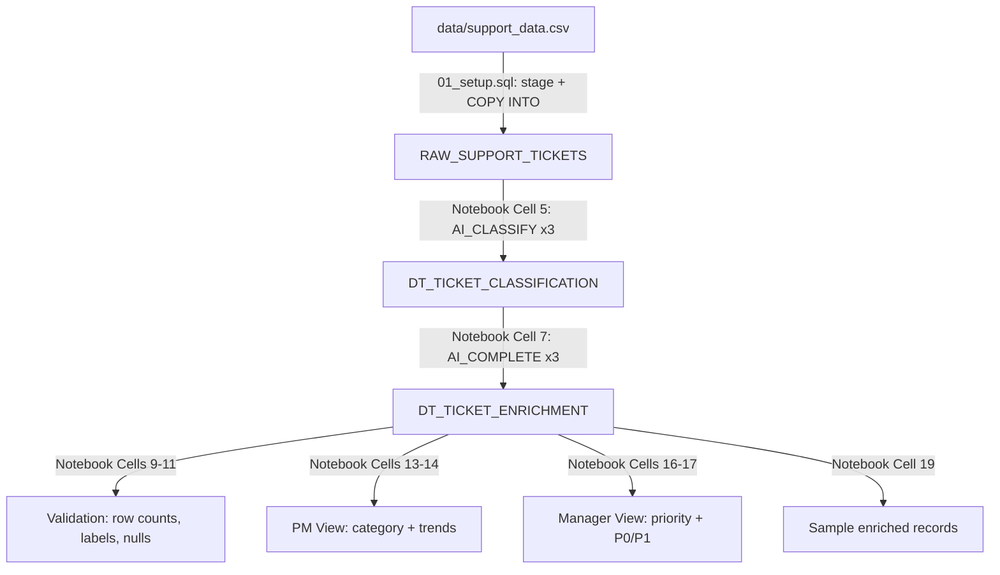

# Plan: SQL Data-Loading + Notebook Pipeline

## Context

The project has reference docs ([docs/pipeline.md](docs/pipeline.md), [docs/taxonomy.md](docs/taxonomy.md), [docs/prompts.md](docs/prompts.md)) and a CSV at [data/support_data.csv](data/support_data.csv). The `sql/` and `notebooks/` folders are currently empty.

Per the user's direction:
- **SQL folder** contains only the setup/load script.
- **Notebook** contains everything else: Dynamic Table creation, validation, charts, sample enrichment outputs.
- **Connection**: `oregon_tp` (account: SNOWHOUSE, role: PUBLIC, warehouse: SNOWADHOC -- pipeline SQL will explicitly USE WAREHOUSE AI_WH).
- **Plan artifact**: saved to [docs/pipeline-plan.md](docs/pipeline-plan.md) alongside existing project docs.

### AI Function Skill Best Practices Applied

From the `cortex-ai-functions` skill references:

| Best Practice | How Applied |
|---------------|-------------|
| Display cost estimate before execution | Notebook includes a markdown cell with token/credit estimates before running the DT creation cells |
| Use `task_description` in AI_CLASSIFY config | All three AI_CLASSIFY calls include a `task_description` string for context |
| Use label `description` objects for ambiguous categories | Categories like "Other", "Unknown", "UI/UX" get description objects |
| Use `:labels[0]::VARCHAR` to extract single label | All AI_CLASSIFY outputs use this pattern |
| AI_COMPLETE: use named argument syntax | Enrichment DT uses `AI_COMPLETE(model => ..., prompt => ...)` for clarity |
| Require `SNOWFLAKE.CORTEX_USER` role | Setup SQL includes the GRANT statement |
| Non-deterministic output warning | Notebook markdown cell notes this |

### Dynamic Tables + AI Functions Compatibility

The official [Dynamic table limitations](https://docs.snowflake.com/en/user-guide/dynamic-tables-limitations) page does **not** prohibit AI functions. AI functions are non-deterministic, which means Snowflake will use **full refresh mode** (not incremental). This is acceptable for this demo since the dataset is static and refresh frequency is daily.

---

## File 1: [sql/01_setup.sql](sql/01_setup.sql)

**Purpose:** Create infrastructure and load raw data. This is the only file in `sql/`.

```sql
USE WAREHOUSE AI_WH;

CREATE DATABASE IF NOT EXISTS SNOW_INSAIGHT_DEMO;
CREATE SCHEMA IF NOT EXISTS SNOW_INSAIGHT_DEMO.SUPPORT;
USE SCHEMA SNOW_INSAIGHT_DEMO.SUPPORT;

-- Grant Cortex AI function access (required by AI_CLASSIFY / AI_COMPLETE)
GRANT DATABASE ROLE SNOWFLAKE.CORTEX_USER TO ROLE PUBLIC;

-- Internal stage for CSV upload
CREATE OR REPLACE STAGE SUPPORT_STAGE
  DIRECTORY = (ENABLE = TRUE)
  ENCRYPTION = (TYPE = 'SNOWFLAKE_SSE');

-- Raw table matching CSV columns exactly
CREATE OR REPLACE TABLE RAW_SUPPORT_TICKETS (
    TICKET_ID                   VARCHAR,
    SUBMIT_DATE                 DATE,
    SUBMIT_TIMESTAMP            TIMESTAMP_NTZ,
    CUSTOMER_ID                 VARCHAR,
    CUSTOMER_TIER               VARCHAR,
    CHANNEL                     VARCHAR,
    PRIORITY                    VARCHAR,
    STATUS                      VARCHAR,
    PRODUCT_AREA                VARCHAR,
    CLASSIFICATION              VARCHAR,
    SENTIMENT                   VARCHAR,
    FIRST_RESPONSE_TIME_HOURS   NUMBER(10,2),
    RESOLUTION_TIME_HOURS       NUMBER(10,2),
    TICKET_SUBJECT              VARCHAR,
    TICKET_DESCRIPTION          TEXT,
    AGENT_NOTES                 TEXT
);

-- PUT is run separately (SnowSQL, notebook, or Snowsight upload):
--   PUT file:///path/to/data/support_data.csv @SUPPORT_STAGE AUTO_COMPRESS=TRUE;

COPY INTO RAW_SUPPORT_TICKETS
  FROM @SUPPORT_STAGE/support_data.csv
  FILE_FORMAT = (
    TYPE = 'CSV'
    SKIP_HEADER = 1
    FIELD_OPTIONALLY_ENCLOSED_BY = '"'
    ESCAPE_UNENCLOSED_FIELD = NONE
  )
  ON_ERROR = 'CONTINUE';
```

---

## File 2: [notebooks/support_ticket_demo.ipynb](notebooks/support_ticket_demo.ipynb)

**Purpose:** Main demo artifact. Uses a mix of SQL-via-cursor and Python (pandas + matplotlib) to build the pipeline, validate it, and visualize results.

### Cell-by-cell structure

#### Section A: Setup and Data Load

```
Cell 1 (markdown):  # Support Ticket Intelligence Demo
                    Overview of the pipeline, link to docs/pipeline.md.

Cell 2 (code):      # Connect to Snowflake using oregon_tp connection
                    import os, snowflake.connector, pandas as pd, matplotlib.pyplot as plt
                    conn = snowflake.connector.connect(
                        connection_name=os.getenv("SNOWFLAKE_CONNECTION_NAME") or "oregon_tp"
                    )
                    cur = conn.cursor()
                    cur.execute("USE WAREHOUSE AI_WH")
                    cur.execute("USE SCHEMA SNOW_INSAIGHT_DEMO.SUPPORT")

Cell 3 (code):      # PUT local CSV to stage + COPY INTO raw table
                    cur.execute("PUT file://.../data/support_data.csv @SUPPORT_STAGE AUTO_COMPRESS=TRUE OVERWRITE=TRUE")
                    cur.execute("""COPY INTO RAW_SUPPORT_TICKETS ... ON_ERROR='CONTINUE'""")
                    # Print row count
                    cur.execute("SELECT COUNT(*) FROM RAW_SUPPORT_TICKETS")
                    print(f"Loaded {cur.fetchone()[0]} rows")
```

#### Section B: Classification Dynamic Table

```
Cell 4 (markdown):  ## Cost Estimate: AI_CLASSIFY
                    Estimates based on ~2000 tickets, ~500 tokens avg per ticket, 3 classify calls:
                    - Input: ~3M tokens total -> ~4.5 credits
                    - Output: minimal (label only)
                    Note: AI functions produce non-deterministic output. Dynamic Table will
                    use full refresh mode.

Cell 5 (code):      # Create DT_TICKET_CLASSIFICATION with AI_CLASSIFY
                    cur.execute("""
                    CREATE OR REPLACE DYNAMIC TABLE DT_TICKET_CLASSIFICATION
                      WAREHOUSE = AI_WH
                      TARGET_LAG = '1 day'
                    AS
                    SELECT
                        t.*,
                        AI_CLASSIFY(
                            t.TICKET_DESCRIPTION,
                            [
                              {'label':'Billing',        'description':'Invoicing, charges, refunds, subscription changes'},
                              {'label':'Authentication', 'description':'Login, SSO, password, session, permissions'},
                              {'label':'Performance',    'description':'Slowness, timeouts, latency, degradation'},
                              {'label':'UI/UX',          'description':'Dashboard display, usability, interface issues'},
                              {'label':'Integrations',   'description':'API connectors, data sync, third-party tools'},
                              {'label':'Data Platform',  'description':'Query engine, data pipeline, analytics processing'},
                              {'label':'Security',       'description':'Encryption, compliance, vulnerability, access control'},
                              {'label':'Other',          'description':'Does not fit any other category'}
                            ],
                            {'task_description': 'Classify this support ticket into the product category it belongs to'}
                        ):labels[0]::VARCHAR AS PRODUCT_CATEGORY,

                        AI_CLASSIFY(
                            t.TICKET_DESCRIPTION,
                            [
                              {'label':'Bug',                 'description':'Software defect or broken functionality'},
                              {'label':'Feature Request',     'description':'Request for new capability or enhancement'},
                              {'label':'Configuration Issue', 'description':'Setup, settings, or config problem'},
                              {'label':'Data Issue',          'description':'Wrong data, missing data, data corruption'},
                              {'label':'Usage Question',      'description':'How-to question about using the product'},
                              {'label':'Access Problem',      'description':'Cannot access a resource due to permissions'},
                              {'label':'Unknown',             'description':'Cannot determine the issue type'}
                            ],
                            {'task_description': 'Classify this support ticket by the type of issue reported'}
                        ):labels[0]::VARCHAR AS ISSUE_TYPE,

                        AI_CLASSIFY(
                            t.TICKET_DESCRIPTION,
                            [
                              {'label':'P0', 'description':'Critical outage affecting production or revenue'},
                              {'label':'P1', 'description':'Major issue with significant business impact'},
                              {'label':'P2', 'description':'Moderate issue with workaround available'},
                              {'label':'P3', 'description':'Minor issue or cosmetic problem'}
                            ],
                            {'task_description': 'Assess the urgency of this support ticket based on business impact described'}
                        ):labels[0]::VARCHAR AS PRIORITY_BUCKET
                    FROM RAW_SUPPORT_TICKETS t
                    """)
                    print("DT_TICKET_CLASSIFICATION created")
```

#### Section C: Enrichment Dynamic Table

```
Cell 6 (markdown):  ## Cost Estimate: AI_COMPLETE
                    Estimates based on ~2000 tickets, 3 completions per ticket:
                    - Input: ~3M tokens -> ~4.5 credits
                    - Output: ~600K tokens -> ~4.5 credits
                    - Total estimate: ~9 credits for enrichment layer

Cell 7 (code):      # Create DT_TICKET_ENRICHMENT with AI_COMPLETE
                    cur.execute("""
                    CREATE OR REPLACE DYNAMIC TABLE DT_TICKET_ENRICHMENT
                      WAREHOUSE = AI_WH
                      TARGET_LAG = '1 day'
                    AS
                    SELECT
                        c.*,
                        AI_COMPLETE(
                            model => 'mistral-large2',
                            prompt => 'Summarize this support ticket in one sentence:\n\n' || c.TICKET_DESCRIPTION
                        ) AS SUMMARY_TEXT,
                        AI_COMPLETE(
                            model => 'mistral-large2',
                            prompt => 'Explain briefly why this support ticket was classified as:\n\n'
                                || 'product_category: ' || c.PRODUCT_CATEGORY || '\n'
                                || 'issue_type: '       || c.ISSUE_TYPE       || '\n'
                                || 'priority_bucket: '  || c.PRIORITY_BUCKET  || '\n\n'
                                || 'Ticket:\n' || c.TICKET_DESCRIPTION
                        ) AS RATIONALE,
                        AI_COMPLETE(
                            model => 'mistral-large2',
                            prompt => 'Given this support ticket, suggest the next best action for a support manager:\n\n'
                                || c.TICKET_DESCRIPTION
                        ) AS MANAGER_RECOMMENDATION
                    FROM DT_TICKET_CLASSIFICATION c
                    """)
                    print("DT_TICKET_ENRICHMENT created")
```

#### Section D: Validation

```
Cell 8 (markdown):  ## Validation
                    Checks from docs/pipeline.md: row counts, label coverage, key fields populated.

Cell 9 (code):      # Row count comparison across pipeline stages
                    for table in ['RAW_SUPPORT_TICKETS', 'DT_TICKET_CLASSIFICATION', 'DT_TICKET_ENRICHMENT']:
                        cur.execute(f"SELECT COUNT(*) FROM {table}")
                        print(f"{table}: {cur.fetchone()[0]} rows")

Cell 10 (code):     # Label coverage: verify all labels are within taxonomy
                    df_labels = pd.read_sql("""
                        SELECT PRODUCT_CATEGORY, ISSUE_TYPE, PRIORITY_BUCKET, COUNT(*) AS CNT
                        FROM DT_TICKET_CLASSIFICATION
                        GROUP BY ALL ORDER BY CNT DESC
                    """, conn)
                    display(df_labels)

Cell 11 (code):     # Null check on enrichment columns
                    df_nulls = pd.read_sql("""
                        SELECT
                            COUNT_IF(SUMMARY_TEXT IS NULL) AS null_summary,
                            COUNT_IF(RATIONALE IS NULL) AS null_rationale,
                            COUNT_IF(MANAGER_RECOMMENDATION IS NULL) AS null_recommendation,
                            COUNT(*) AS total
                        FROM DT_TICKET_ENRICHMENT
                    """, conn)
                    display(df_nulls)
```

#### Section E: PM View

```
Cell 12 (markdown): ## PM View: Product Category and Issue Trends

Cell 13 (code):     # Bar chart: tickets by product_category
                    df_cat = pd.read_sql("""
                        SELECT PRODUCT_CATEGORY, COUNT(*) AS TICKET_COUNT
                        FROM DT_TICKET_CLASSIFICATION
                        GROUP BY PRODUCT_CATEGORY ORDER BY TICKET_COUNT DESC
                    """, conn)
                    df_cat.plot.barh(x='PRODUCT_CATEGORY', y='TICKET_COUNT')
                    plt.title('Tickets by Product Category')
                    plt.tight_layout()
                    plt.show()

Cell 14 (code):     # Line chart: issue trends over time (weekly)
                    df_trend = pd.read_sql("""
                        SELECT DATE_TRUNC('WEEK', SUBMIT_DATE) AS WEEK, PRODUCT_CATEGORY, COUNT(*) AS CNT
                        FROM DT_TICKET_CLASSIFICATION
                        GROUP BY ALL ORDER BY WEEK
                    """, conn)
                    df_trend.pivot(index='WEEK', columns='PRODUCT_CATEGORY', values='CNT').plot()
                    plt.title('Issue Trends Over Time')
                    plt.tight_layout()
                    plt.show()
```

#### Section F: Support Manager View

```
Cell 15 (markdown): ## Support Manager View: Priority Distribution and P0/P1 Trends

Cell 16 (code):     # Bar chart: tickets by priority_bucket
                    df_pri = pd.read_sql("""
                        SELECT PRIORITY_BUCKET, COUNT(*) AS TICKET_COUNT
                        FROM DT_TICKET_CLASSIFICATION
                        GROUP BY PRIORITY_BUCKET ORDER BY PRIORITY_BUCKET
                    """, conn)
                    df_pri.plot.bar(x='PRIORITY_BUCKET', y='TICKET_COUNT')
                    plt.title('Tickets by Priority Bucket')
                    plt.tight_layout()
                    plt.show()

Cell 17 (code):     # Line chart: P0/P1 high-priority trends over time
                    df_high = pd.read_sql("""
                        SELECT DATE_TRUNC('WEEK', SUBMIT_DATE) AS WEEK, PRIORITY_BUCKET, COUNT(*) AS CNT
                        FROM DT_TICKET_CLASSIFICATION
                        WHERE PRIORITY_BUCKET IN ('P0','P1')
                        GROUP BY ALL ORDER BY WEEK
                    """, conn)
                    df_high.pivot(index='WEEK', columns='PRIORITY_BUCKET', values='CNT').plot()
                    plt.title('P0/P1 Trends Over Time')
                    plt.tight_layout()
                    plt.show()
```

#### Section G: Sample Enrichment Outputs

```
Cell 18 (markdown): ## Sample Enriched Records

Cell 19 (code):     # Display 5 enriched tickets
                    df_samples = pd.read_sql("""
                        SELECT TICKET_ID, TICKET_SUBJECT, PRODUCT_CATEGORY, ISSUE_TYPE, PRIORITY_BUCKET,
                               SUMMARY_TEXT, RATIONALE, MANAGER_RECOMMENDATION
                        FROM DT_TICKET_ENRICHMENT
                        LIMIT 5
                    """, conn)
                    for _, row in df_samples.iterrows():
                        print(f"--- {row['TICKET_ID']}: {row['TICKET_SUBJECT']} ---")
                        print(f"Classification: {row['PRODUCT_CATEGORY']} / {row['ISSUE_TYPE']} / {row['PRIORITY_BUCKET']}")
                        print(f"Summary: {row['SUMMARY_TEXT']}")
                        print(f"Rationale: {row['RATIONALE']}")
                        print(f"Recommendation: {row['MANAGER_RECOMMENDATION']}\n")
```

---

## Data Flow



---

## Rules Cross-Check

| Rule (from pipeline.md / taxonomy.md) | How Met |
|----------------------------------------|---------|
| AI_CLASSIFY only for labels | Cell 5 uses AI_CLASSIFY for product_category, issue_type, priority_bucket |
| AI_COMPLETE only for summaries/insights | Cell 7 uses AI_COMPLETE for summary_text, rationale, manager_recommendation |
| Do not classify same field twice | Each field has exactly one AI_CLASSIFY call |
| Keep raw data separate from derived | RAW_SUPPORT_TICKETS untouched; derived columns in downstream DTs |
| Labels within taxonomy | Label arrays match docs/taxonomy.md exactly |
| Row counts match across stages | Notebook Cell 9 validates |
| Key fields populated | Notebook Cell 11 checks for NULLs |
| Spot check sample records | Notebook Cells 10 + 19 |
| Cost estimate before AI calls (skill) | Markdown cells 4 + 6 show estimates |
| task_description for AI_CLASSIFY (skill) | All 3 AI_CLASSIFY calls include task_description |
| Label descriptions for ambiguous categories (skill) | All categories use label/description objects |
| Named args for AI_COMPLETE (skill) | Uses model =>, prompt => syntax |
| CORTEX_USER role required (skill) | Setup SQL includes GRANT statement |
